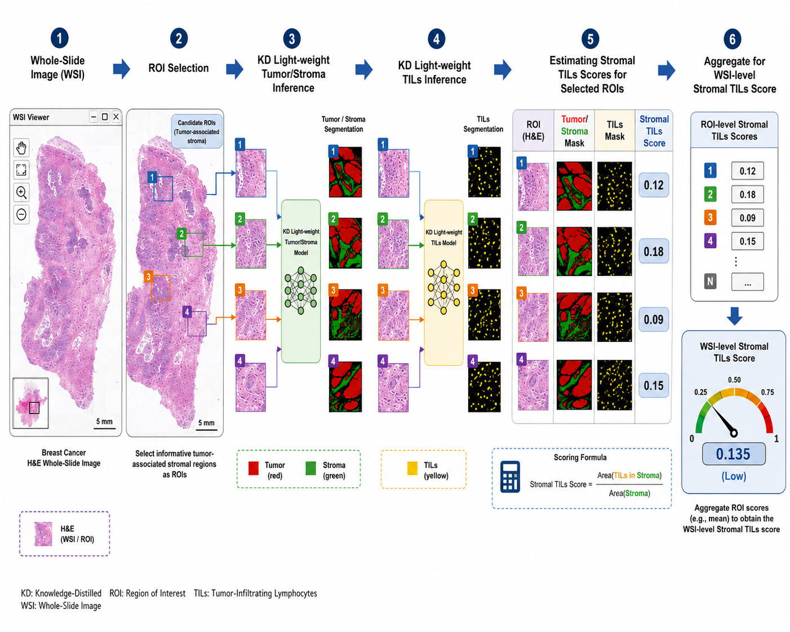
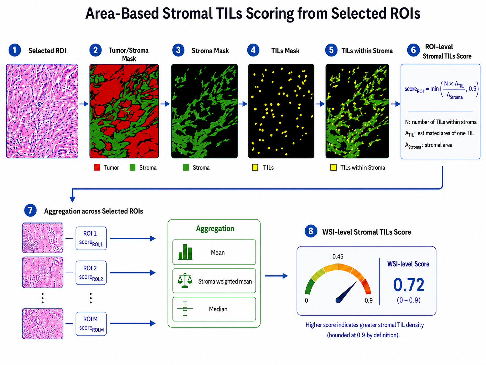

# KD WSI-level Stromal TILs Scoring

This repository provides a clean KD-only inference pipeline for fully automated WSI-level stromal TILs scoring from H&E whole-slide images.

The pipeline performs:

1. Tissue filtering and candidate ROI grid generation.
2. Tumor/stroma segmentation using the KD FastSCNN model.
3. Tumor-associated/stromal ROI selection with neighbor rescue.
4. TILs segmentation using the KD FastSCNN model.
5. Area-based stromal TILs scoring inside selected stromal regions.
6. WSI-level aggregation using mean, stroma-weighted mean, and median.
7. Per-slide outputs and global summary generation with processing time.


## Framework figures

### Overall framework overview

The figure below summarizes the complete KD-based WSI-level stromal TILs scoring pipeline, including WSI input, ROI selection, KD tumor/stroma inference, KD TILs inference, ROI-level scoring, and WSI-level aggregation.



### Area-based stromal TILs scoring workflow

The figure below illustrates the area-based stromal TILs scoring step used after ROI selection, including tumor/stroma masking, stroma extraction, TILs masking, TILs-within-stroma estimation, ROI-level scoring, and WSI-level aggregation.




## Repository structure

```text
KD_WSI_sTILs_Scoring_GitHub/
├── Inputs/                  # Input WSI files
├── Models/                  # Included KD model weights
│   ├── tumor_stroma_fastscnn_kd.weights.h5
│   └── tils_fastscnn_kd.weights.h5
├── Outputs/                 # Per-slide outputs and summary files
├── Figures/                 # Framework and scoring workflow figures
│   ├── framework_overview.png
│   └── stromal_tils_scoring_workflow.png
├── Scripts/                 # Pipeline scripts
│   ├── Fast_SCNN_Model.py
│   ├── config.py
│   ├── inference.py
│   ├── model_utils.py
│   ├── pipeline.py
│   ├── roi_selection.py
│   ├── scoring.py
│   ├── tissue_mask.py
│   ├── utils.py
│   ├── visualization.py
│   ├── wsi_io.py
│   └── run_pipeline.py
├── requirements.txt
└── README.md
```

## Included model and architecture files

This release includes the KD FastSCNN model weights and the FastSCNN architecture file used by the inference pipeline.

```text
Models/tumor_stroma_fastscnn_kd.weights.h5
Models/tils_fastscnn_kd.weights.h5
Scripts/Fast_SCNN_Model.py
```

The default configuration loads these files automatically when running the pipeline. The architecture file contains the `build_fast_scnn(...)` function used to reconstruct the KD models before loading the saved weights.


## Installation

```bash
pip install -r requirements.txt
```

On Windows, install OpenSlide binaries and make sure they are available in `PATH`.

## Run the pipeline

Default run:

```bash
python Scripts/run_pipeline.py
```

Custom paths:

```bash
python Scripts/run_pipeline.py \
  --input_dir Inputs \
  --model_dir Models \
  --output_dir Outputs
```

Debug run on the first 20 ROI windows only:

```bash
python Scripts/run_pipeline.py --max_windows 20
```

Force reprocessing:

```bash
python Scripts/run_pipeline.py --overwrite
```

## Outputs

For each WSI, outputs are saved under:

```text
Outputs/PerSlideResults/<slide_id>/
```

Important files:

```text
tables/raw_roi_selection_features.csv
tables/all_roi_selection_decisions.csv
tables/selected_rois_before_tils_scoring.csv
tables/roi_scores.csv
tables/final_summary.csv
tables/timing.csv
tables/timing_report.txt
geojson/all_selected_rois.geojson
```

Global outputs:

```text
Outputs/summary/summary.csv
Outputs/summary/summary.xlsx
Outputs/summary/batch_processing_report.txt
Outputs/summary/failed_wsi_processing.csv
```

## Main WSI-level scores

The global summary reports:

```text
score_mean_percent
score_stroma_weighted_mean_percent
score_median_percent
```

The corresponding fractional values are also saved.
